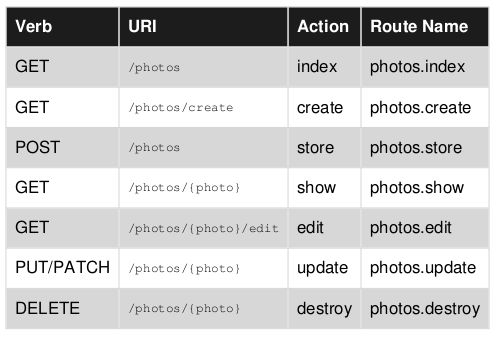

# QuickRoute
An elegant http router built on top of [FastRoute](https://github.com/nikic/FastRoute) to provide more easy of use.

## Upgrade Guide
Check [ChangeLog](CHANGELOG.md) file

## Installation
```bash
composer require ahmard/quick-route
```

## Usage

Simple example

```php
use QuickRoute\Route;
use QuickRoute\Router\Dispatcher;

require('vendor/autoload.php');

Route::get('/', function () {
    echo 'Hello world';
});

$method = $_SERVER['REQUEST_METHOD'];
$path = $_SERVER['REQUEST_URI'];

//create route dispatcher
$dispatcher = Dispatcher::collectRoutes()
    ->dispatch($method, $path);

//determine dispatch result
switch (true) {
    case $dispatcher->isFound():
        $handler = $dispatcher->getRoute()->getHandler();
        $handler($dispatcher->getUrlParameters());
        break;
    case $dispatcher->isNotFound():
        echo "Page not found";
        break;
    case $dispatcher->isMethodNotAllowed():
        echo "Request method not allowed";
        break;
}
```

#### Controller-like example

```php
use QuickRoute\Route;

Route::get('/home', 'MainController@home');
```

#### Advance usage

```php
use QuickRoute\Route;

Route::prefix('user')->name('user.')
    ->namespace('User')
    ->middleware('UserMiddleware')
    ->group(function (){
        Route::get('profile', 'UserController@profile');
        Route::put('update', 'UserController@update');
    });
```

#### More Advance Usage

```php
use QuickRoute\Route;

Route::prefix('user')
    ->prepend('api')
    ->append('{token}')
    ->middleware('UserMiddleware')
    ->group(function (){
        Route::get('profile', 'UserController@profile');
        Route::put('update', 'UserController@update');
    });

// => /api/user/{token}
```

#### Defining route param types
```php
use QuickRoute\Route;

// id => must be number
Route::get('users/{id}', 'Controller@index')->whereNumber('id');
// name => must be alphabetic
Route::get('users/{name}', 'Controller@profile')->whereAlpha('name');
// username => must be alphanumeric
Route::get('users/{username}', 'Controller@profile')->whereAlphaNumeric('username');

// Manually provide regular expression pattern to match parameter with
Route::get('/users/{id}', 'a')->where('id', '[0-9]+');
Route::get('/users/{user}/posts/{post}', 'Ctrl@method')->where([
    'user' => '[a-zA-Z]+',
    'post' => '[0-9]+'
]);
```

#### Route Fields
Fields help to add more description to route or group of routes

```php
use QuickRoute\Route;

Route::prefix('user')
    ->middleware('User')
    ->addField('specie', 'human')
    ->group(function (){
        Route::get('type', 'admin')->addField('permissions', 'all');
        Route::get('g', fn() => print('Hello world'));
    });

```

#### Route::match()
```php
use QuickRoute\Route;
use QuickRoute\Router\Collector;
use QuickRoute\Router\Dispatcher;

require 'vendor/autoload.php';

$handler = fn() => print time();
Route::match(['get', 'post'], '/user', $handler)
    ->middleware('auth')
    ->namespace('App')
    ->name('home');

$collector = Collector::create()->collect();

$dispatchResult = Dispatcher::create($collector)
    ->dispatch('get', '/user/hello');

var_export($dispatchResult->getRoute());
```

#### Route::match() with named routes
```php
use QuickRoute\Route;

Route::match(['get', 'post'], 'login', 'AuthController@login')->name('login.');

//Will generate below routes
Route::get('login', 'AuthController@login')->name('login.get');
Route::post('login', 'AuthController@login')->name('login.post');
```

#### Route::any()

```php
use QuickRoute\Route;
use QuickRoute\Router\Collector;
use QuickRoute\Router\Dispatcher;

$handler = fn() => print time();

Route::any(['/login', '/admin/login'], 'get', $handler);

$collector = Collector::create()->collect();

$dispatchResult1 = Dispatcher::create($collector)
    ->dispatch('get', '/login');
    
$dispatchResult2 = Dispatcher::create($collector)
    ->dispatch('get', '/admin/login');
```

#### Route::matchAny()

```php
use QuickRoute\Route;

Route::matchAny(
    ['get', 'post'], 
    ['/customer/login', '/admin/login'],
    'MainController@index'
);

//Which is equivalent to:
Route::get('/customer/login', 'MainController@index');
Route::post('/customer/login', 'MainController@index');
Route::get('/admin/login', 'MainController@index');
Route::post('/admin/login', 'MainController@index');
```

#### Route::resource()

```php
use QuickRoute\Route;

Route::resource('photos', 'App\Http\Controller\PhotoController');
```
Code above will produce below routes <br/>


#### Routes as configuration

```php
//routes.php
use QuickRoute\Route;

Route::get('/', 'MainController@index');
Route::get('/help', 'MainController@help');


//server.php
use QuickRoute\Router\Collector;

$collector = Collector::create()
    ->collectFile('routes.php')
    ->register();

$routes = $collector->getCollectedRoutes();
```

#### Caching
Cache routes so that they don't have to be collected every time.

```php
use QuickRoute\Router\Collector;

$collector = Collector::create()
    ->collectFile('routes.php')
    ->cache('path/to/save/cache.php', false)
    ->register();

$routes = $collector->getCollectedRoutes();
```

Caching routes with closure

```php
use QuickRoute\Route;
use QuickRoute\Router\Collector;

Route::get('/', function (){
    echo uniqid();
});

$collector = Collector::create()
    ->collect()
    ->cache('path/to/save/cache.php', true)
    ->register();

$routes = $collector->getCollectedRoutes();
```
**Note that you must specify that your routes contains closure**


#### Passing Default Data
You can alternatively pass data to be prepended to all routes.
<br/>
Cached routes must be cleared manually after setting/updating default route data.

```php
use QuickRoute\Router\Collector;

$collector = Collector::create();
$collector->collectFile('api-routes.php', [
    'prefix' => 'api',
    'name' => 'api.',
    'namespace' => 'Api\\'
]);
$collector->register();
```

#### Changing Delimiter
For usage outside of web context, a function to change default delimiter which is "**/**" has been provided.

```php
use QuickRoute\Route;
use QuickRoute\Router\Collector;
use QuickRoute\Router\Dispatcher;

require 'vendor/autoload.php';

Route::prefix('hello')
    ->group(function () {
        Route::get('world', fn() => print('Hello World'));
    });

$collector = Collector::create()
    ->prefixDelimiter('.')
    ->collect()
    ->register();

$dispatchResult = Dispatcher::create($collector)
    ->dispatch('get', 'hello.world');

var_export($dispatchResult);
```

#### Finding route & generating route uri

```php
use QuickRoute\Route;
use QuickRoute\Router\Collector;

Route::get('/users', 'Controller@method')->name('users.index');

$collector = Collector::create()->collect();
echo $collector->uri('users.index');  // => /users
$collector->route('users.index'); // => Instance of QuickRoute\Route\RouteData
```

#### Note
- You must be careful when using **Collector::collect()** and **Collector::collectFile()** together, 
as collectFile method will clear previously collected routes before it starts collecting.<br/>
Make sure that you call **Collector::collect()** first, before calling **Collector::collectFile()**.


## Licence
_Route http verbs image is owned by [Riptutorial](https://riptutorial.com)_.

**QuickRoute** is **MIT** licenced.
